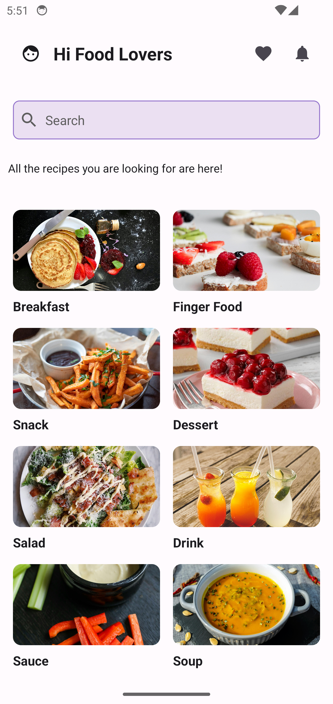
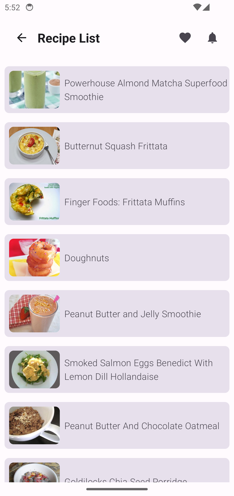
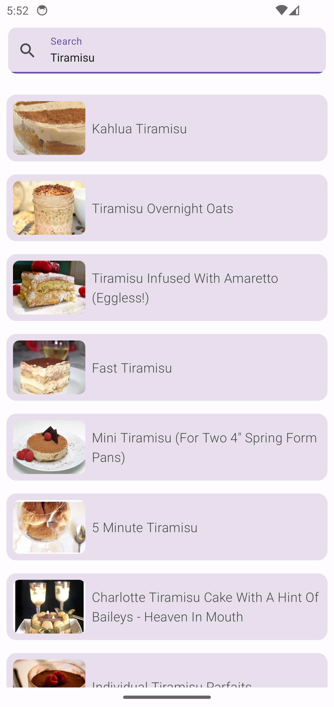
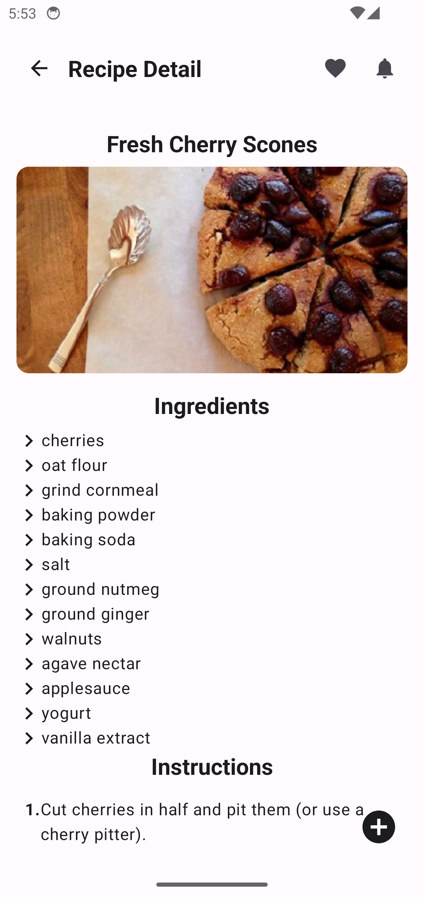
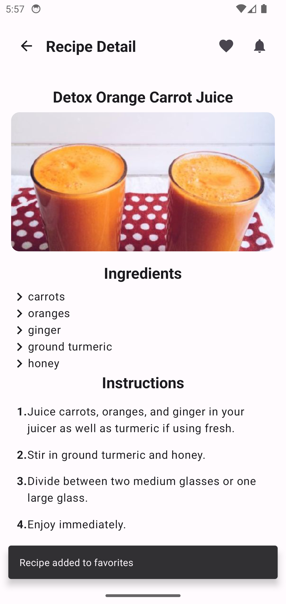
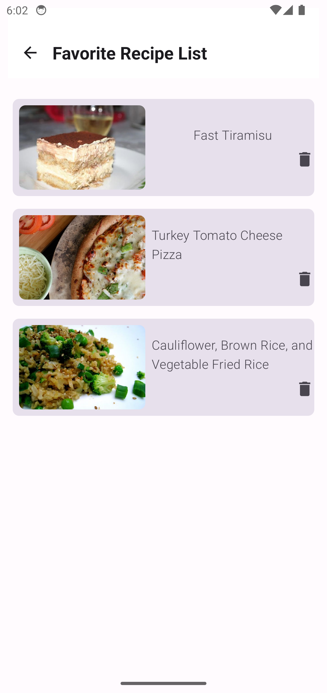

<h3 align="center">RECIPE APP</h3>

  RecipeApp, a Recipes App in Jetpack Compose and Hilt based on modern Android tech-stacks and MVI clean architecture.In this application, users can browse recipes in different categories, get detailed information about the recipes, and even access their favorite recipes without internet.
   

 

## Screens

  
  
  
  
  
  

### API Keys
Recipe App uses [Spoonacular API](https://spoonacular.com/food-api/docs)

## Tech Stack & Open-Source Libraries
* Navigation
* Jetpack Compose
* MVVM
* Retrofit
* Room
* Dependency Injection
* State Hoisting
* Side Effect
* Coil
